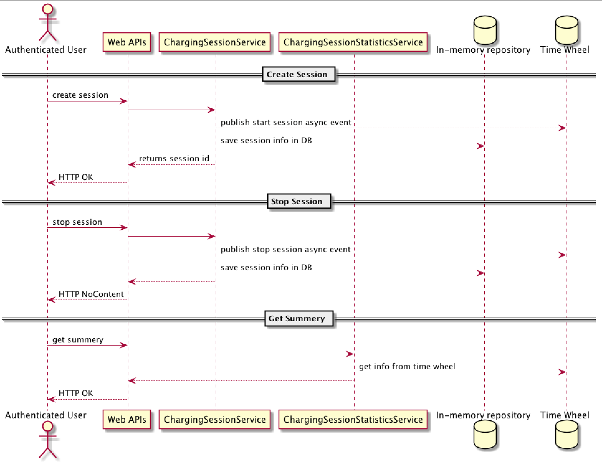

# EVBOX Charging Station Sessions APIs

EVBox Charging Station Sessions APIs provides
- Create session.
- Stop session.
- Real-time summery of session using Time Wheel data structure.



### How to run

###### Prerequisite 
- JDK 1.8 (Tested with Oracle JDK)
- Maven 3.x+

###### Build
```
$ mvn clean compile install
```

###### Run
```
$ java -jar target/evbox-charging-station-sessions-1.0.0.jar
```
or
```
$ mvn spring-boot:run
```

###### Quick test
Create session
```
curl -X POST localhost:8080/chargingSession  
```
example response
```
{"id":"bda6acd8-aa5f-463f-a9de-cff8d3e226e2"}
```

Stop session (id from above call)
```
curl -X PUT localhost:8080/chargingSession/bda6acd8-aa5f-463f-a9de-cff8d3e226e2
```

Get summery
```
curl -X GET localhost:8080/chargingSessions
```
example response
```
{"totalCount":0,"startedCount":0,"stoppedCount":1}
```

Get started session summery
```
curl -X GET localhost:8080/chargingSessions/started
```
example response
```
{"startedCount":0}
```

Get stopped session summery
```
curl -X GET localhost:8080/chargingSessions/stopped
```
example response
```
{"stoppedCount":0}
```

### Development
##### How to run tests

###### How to run unit tests
To run the unit tests, execute the following commands
```
mvn clean test-compile test
```

###### How to run integration tests
To run the integration tests, execute the following commands
```
mvn clean test-compile verify -DskipTests=true
```

###### How to run both unit tests and integration tests
To run the integration tests, execute the following commands
```
mvn clean test-compile verify
```

###### How to run pitest
To run the mutation tests, execute the following commands
```
mvn clean test-compile test
mvn org.pitest:pitest-maven:mutationCoverage
```

### Improvements to make
- Make more generic SessionCountTimeWheel class, separate session count logic out of it.
- Make wheel size and rotation speed configurable in SessionCountTimeWheel class.
- Generate and check OWASP report.
- Add logging.
